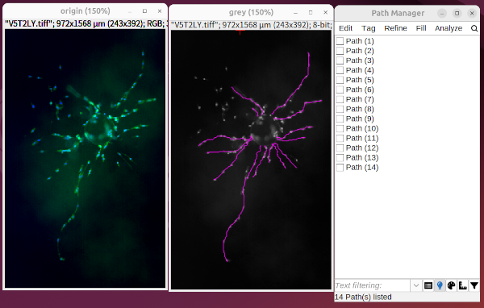

# SNT

* [SNT網站](https://imagej.net/plugins/snt/index)  
* [教學影片](https://youtu.be/O-thWnEP9dQ)

## 安裝

SNT 目前是透過 Fiji 的 `Neuroanatomy` 更新站點進行分發。

第一次從 Fiji 選單 (`Plugins › Neuroanatomy › SNT`) 啟動 SNT 時，系統應該會提示自動下載所需的相依套件。如果沒有出現提示：

1.  執行 Fiji  (`Help › Update…`)。
2.  點擊 `Manage update sites`。
3.  搜尋並勾選 `Neuroanatomy` 更新站點。
4.  點擊 `Apply changes` 並重新啟動 Fiji。

## 自動追蹤

1. 建立二值化影像，並圈選出細胞本體，然後開啟SNT，如果合要求，自動會問是否進行自動追蹤。
2. 若無，則在SNT視窗執行`File > Autotrace Segmented Image..`進行設定
3. 若要更改參數重作trace，則執行SNT的`Utitlities > Extract Paths from Segmented Image...`

## 手動追蹤

### 1. 開始一條新路徑

#### 步驟 I：選擇起點
-   **`S` 鍵：** 切換游標自動吸附功能。預設情況下，游標會自動吸附到附近最亮的像素。若要手動控制節點位置，可以按 `S` 鍵關閉此功能。
-   **左鍵點擊：** 在影像中找到路徑的起點，點擊左鍵來標記它。

#### 步驟 II：選擇後續點
-   **左鍵點擊：** 移動到同一結構上的下一個點，點擊左鍵。SNT 會自動搜尋這兩點之間的路徑。
-   **`C` 或 `Esc` 鍵：** 若自動搜尋進度不佳，可以按 `C` 或 `Esc` 取消搜尋，然後選擇一個離起點更近的點重新嘗試。
-   **`Z` 鍵（在 `Cursor Auto-snapping` 面板中設定）：** 將 Z 值增加到大於 0，可以讓游標在移動時自動在 Z 平面進行導航，幫助你找到最亮的體素。

#### 步驟 III：確認臨時路徑
-   **`Y` 鍵：** 當 SNT 找到路徑後，會顯示為青色（臨時路徑），並詢問是否確認。如果路徑符合預期，按 `Y` 確認。確認後，路徑會變成紅色。
-   **`N` 鍵：** 如果路徑不正確，按 `N` 拒絕，程式會回到上一步，讓您重新選擇後續點。
-   **`F` 鍵：** 當您完成這條路徑的追蹤後，按 `F` 結束路徑。完成的路徑會顯示為洋紅色，程式回到步驟 I，準備開始新路徑。

**小提示：** 熟練後，您可以在 `Options` 選項卡下的 `Temporary Paths` 區塊中關閉臨時路徑的確認步驟，以加快追蹤速度。

### 2. 從現有路徑分岔

#### 步驟 I：選擇要分岔的路徑
-   **`G` 鍵：** 將滑鼠游標移到目標路徑附近，然後按 `G` 來選中它。選中後，路徑會顯示為預設的綠色。
-   **右鍵 → `Select Paths by 2D ROI`：** 在影像上畫一個粗略的 2D 範圍，選取範圍內的路徑。
-   **路徑管理器 (Path Manager)：** 直接在路徑管理器中點擊選取目標路徑。

#### 步驟 II：選擇分岔點
-   **`Alt` + `Shift` + 左鍵點擊：** 按住這兩個鍵，將滑鼠移到分岔點，你會看到游標變成一個帶有「Fork Point」標註的紅色十字。在此點擊左鍵，即可強制在新路徑的起點建立分岔。
-   **右鍵 → `Fork at Nearest Node`：** 另一種方式是放大到分岔點，然後右鍵點擊影像，從右鍵選單中選擇此選項。

#### 步驟 III：延伸路徑
一旦選定分岔點，就可以像追蹤新路徑一樣，依照上述步驟繼續延伸路徑（建立臨時路徑並確認）。當您完成這條分岔路徑時，在路徑管理器中會看到它被記錄為原始路徑的「子路徑」。

**小提示：** 您也可以在 `Options` 選項卡下的 `Temporary Paths` 區塊中簡化分岔的快速鍵組合。

## 精準點位放置

本方法要求 XY、ZY 和 XZ 視圖都可見，以實現精確定位。

1.  **尋找大致位置：** 在 XY 視窗中移動滑鼠，按住 `Shift` 鍵同步所有視圖。
2.  **啟用自動吸附：** 在 `Main` 標籤頁中啟用「游標自動吸附」，讓游標自動吸附到局部最大值。紅色十字游標會標示最有可能的位置。
3.  **放大：** 按 `+` 鍵放大，所有視窗都會以游標位置為中心放大。每次放大後，請確保游標仍停留在目標結構上。您可以在 `Options` 選項卡的 `Views` 元件中調整是否同步所有視圖的縮放。
4.  **定位中心：**
    -   如果自動吸附已啟用，只需將滑鼠懸停在結構上。
    -   否則，在每個視窗中移動滑鼠並使用滾輪，同時按住 `Shift` 鍵同步視圖。
5.  **常用快捷鍵：**
    -   **`S` 鍵：** 隨時按 `S` 可切換自動吸附。
    -   **`M` 鍵：** 按 `M` 可「點擊」體素列中最亮的體素。
6.  **開始路徑：** 在滿意的點位上點擊滑鼠左鍵。
7.  **精修：** 追蹤完成後，可在路徑管理器中使用 `Refine/Fit › Fit Path...` 選項，將路徑對齊到結構的中線。

## 在舊版 3D 查看器中追蹤

舊版 3D 查看器允許在 3D 場景中進行追蹤。

1.  **啟動查看器：** 在 SNT 對話框的 `3D` 選單中，選擇 `Legacy 3D Viewer`。在 `Viewer` 下拉選單中選擇 `New with image…` 並按下 `Apply`。
2.  **追蹤與導航：**
    -   **追蹤模式：** 在 ImageJ 工具列中按 `W` 鍵激活「魔術棒工具」，然後在 3D 場景中點擊。追蹤方式與 2D 相同。
    -   **分岔：** 像 2D 畫布一樣，按住 `Alt` + `Shift` 進行分岔。
    -   **導航模式：** 按 `H` 鍵激活「手形工具」來與場景互動。
    -   **旋轉：** 按住滑鼠中鍵並拖曳。如果手形工具激活，可使用左鍵拖曳。
    -   **平移：** 按住 `Shift` + 滑鼠中鍵並拖曳。如果手形工具激活，可使用 `Shift` + 左鍵拖曳。
    -   **縮放：** 使用滑鼠滾輪。
    -   **提示：** 3D 查看器無法識別 2D 畫布的右鍵選單，例如 `Path Editing`。

## 合併/連接路徑 (Merging/Joining Paths)

您可以在 `Edit Mode` 中合併或連接兩條路徑。

1.  **進入編輯模式：** 選擇一條路徑，在影像畫布上右鍵點擊，選擇 `Edit Mode`。
2.  **激活合併節點：** 將滑鼠懸停在要合併的第一個節點上。
3.  **選擇第二條路徑：** 按 `G` 鍵選擇第二條路徑，並懸停在第二個合併節點上。
4.  **執行合併：** 打開右鍵選單，從 `Connect To (Start Join)` 或 `Connect To (End Join)` 選單中選擇第一條路徑。

> **重要提示：**
> - 只有當至少一個節點是末端節點時才能合併，以避免創建循環。
> - 合併方向從父路徑到子路徑。如果方向錯誤，SNT 會自動重新定向。
> - 禁止創建循環連接。
> - 推薦使用路徑管理器 (Path Manager) 中的 `Edit` 選單來合併或連接路徑。

## 如何獲取所有突起的長度

在 SNT 中，要獲取所有突起（或稱分支、枝芽）的長度，您主要會使用「**Measurements (測量)**」功能。SNT 提供了多種方式來進行測量，具體取決於您是想測量整個細胞的突起，還是選定部分路徑的突起。

### 測量完整細胞的突起長度 (Cell-based Measurements)

如果您想測量一個完整的、已經重建好的細胞（SNT 稱之為「connected component」，即有根的樹狀結構）的所有突起長度，可以這樣操作：

1.  **開啟 SNT 主介面：** 確保您的 SNT 插件已啟動。
2.  **選擇命令：**
    *   在 SNT 的主對話框中，點擊選單列的 `Analysis › Measure…`。
    *   或者，如果您正在使用 Reconstruction Viewer (重建查看器)，則點擊 `Analyze & Measure ›`。
3.  **配置測量對話框：**
    *   這會開啟一個「Measurements」對話框。
    *   在這裡，您可以搜尋和選擇您感興趣的指標。對於「所有突起的長度」，您通常會尋找類似於 **Cable Length (纜線長度)** 或 **Total Length (總長度)** 這樣的指標。
    *   您還可以選擇渲染測量過的細胞，並匯總現有的測量結果。
    *   透過「齒輪」選單 (Gear menu)，還可以訪問離線指南。
4.  **執行測量：** 確認您的選擇後，點擊對話框中的按鈕（通常是 `OK` 或 `Measure`）來執行測量。SNT 會輸出一個表格，其中包含您選擇的所有指標的數據。

### 測量選定路徑的突起長度 (Path-based Measurements)

如果您只想測量 Path Manager 中選定的一組路徑（例如，您只對某個特定區域或特定分支的枝芽長度感興趣），則可以透過 Path Manager 進行操作：

1.  **開啟 Path Manager：** 確保您的 Path Manager 視窗已開啟，並顯示您的重建路徑。
2.  **選擇/過濾路徑：** 在 Path Manager 中，選取（點擊）或過濾出您想要測量的特定路徑。
3.  **選擇命令：** 在 Path Manager 的選單中，點擊 `Analyze › Measurements`。
4.  **獲取結果：** 這將針對您選定的路徑，生成相應的測量結果。

> **區分細胞級和路徑級測量的重要性：**
> SNT 區分了這兩類測量是為了提供靈活性：
> -   **路徑級測量**可以對任何結構執行，甚至是有循環 (loops) 的結構。
> -   **細胞級測量**要求結構必須是一個圖論樹 (graph-theoretic tree)（即沒有循環，每個節點只有一條通往根部的路徑）。
>
> 大部分 SNT 測量指標在 Metrics 頁面有詳細描述。GUI 中可用的測量通常是單一值的指標，而許多其他測量則可以透過腳本來獲取。

### 快速測量 (Quick Measurements)

SNT 還提供了一個便利的 `Quick Measurements` 命令：

-   在 SNT 主對話框的 `Analysis` 選單中。
-   在 Reconstruction Viewer 的 `Analyze & Measure` 選單中。

這個命令會使用預設設定立即檢索常用指標，無需額外的提示。

### 注意事項

-   **擬合路徑 (Fitted Paths)：** 有些細胞級測量可能在混合了擬合和未擬合路徑時不可用，因為路徑是獨立擬合的，可能不知道原始的連通性。若遇到這種情況，測量結果可能顯示為 `NaN`。您可以考慮使用「原地擬合 (Replace existing nodes)」選項來擬合路徑，或使用 Path Manager 的 `Edit › Rebuild…` 命令來重新計算路徑之間的關係。
-   **統計分析：** SNT 可以匯總比較報告和簡單的統計報告（雙樣本 t 檢定/單向 ANOVA），最多支持六組細胞的比較。這在 `Comparing Reconstructions` 中有詳細描述。

