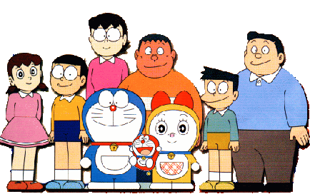

# 空間校正
## Set Scale 
`Analyze > Set Scale...`
使用此對話框來定義當前影像的空間比例，以便測量結果能以校正後的單位（例如公分、毫米）呈現。

在執行此指令之前，應先使用**直線選取工具**畫一條對應已知長度的線段。然後，打開 `Set Scale` 對話框，輸入已知的距離和測量單位，再點擊「OK」。ImageJ 會根據您所畫線段的長度，自動填入「Distance in Pixels」（像素距離）欄位。

*   **Distance in pixels**: 影像中線段選區的長度（像素單位）。ImageJ會自動填入。
*   **Known distance**: 您已知的該線段的實際長度。
*   **Pixel aspect ratio**: 像素的長寬比。通常保持為 1.0。
*   **Unit of length**: 您輸入的已知長度的單位（例如 cm, mm, um）。
*   **Global**: 若勾選此項，此空間校正設定將會應用於之後開啟的所有影像，直到您關閉 ImageJ 或設定新的比例尺。

#### 其他設定
*   將「Distance in Pixels」設為 0 可以恢復為像素測量。
*   將「Pixel Aspect Ratio」（像素長寬比）設定為非 1.0 的值，可以支援不同的水平和垂直空間比例，例如水平方向為 100 像素/公分，而垂直方向為 95 像素/公分。若要設定像素長寬比，請先測量一個已知長寬比為 1:1 的數位化物件的寬度和高度（以像素為單位）。將測得的寬度（像素）輸入到「Distance in Pixels」，將已知的寬度輸入到「Known Distance」。然後，用寬度除以高度計算出長寬比，並將其輸入到「Pixel Aspect Ratio」欄位。

### 圖上加入比例尺
1. 設定好之後，請再執行 `Analyze › Tools › Scale Bar...`，可以將比例尺加在圖上。
2. 觀察`Image > Properties...`與`Image > Show Info...` 。兩者都會顯示空間校正的訊息。

## 實作

### 哆啦A夢有多高？
根據[wikipedia](https://zh.wikipedia.org/zh-tw/%E5%93%86%E5%95%A6A%E5%A4%A2)，哆啦A夢的檔案如下:

*   體重：129.3公斤
*   身高：129.3公分
*   頭圍：129.3公分
*   見到老鼠的驚嚇跳起來的高度：129.3公分
*   見到老鼠的逃跑時速：129.3公里/小時。
是因為哆啦A夢的出生日期是2112/09/03，故皆為1293

### 實作步驟

1.  利用哆啦A夢的身高當作比例尺
2.  分析大雄媽媽有多高？
3.  在圖上加上比例尺。

